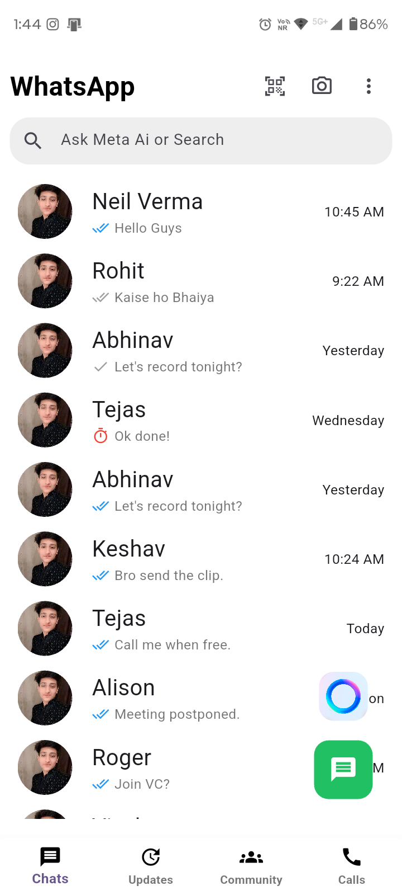
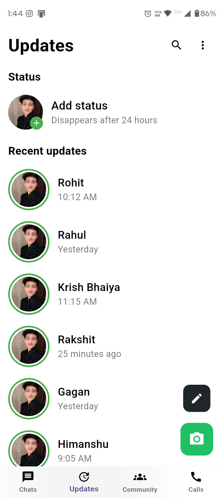
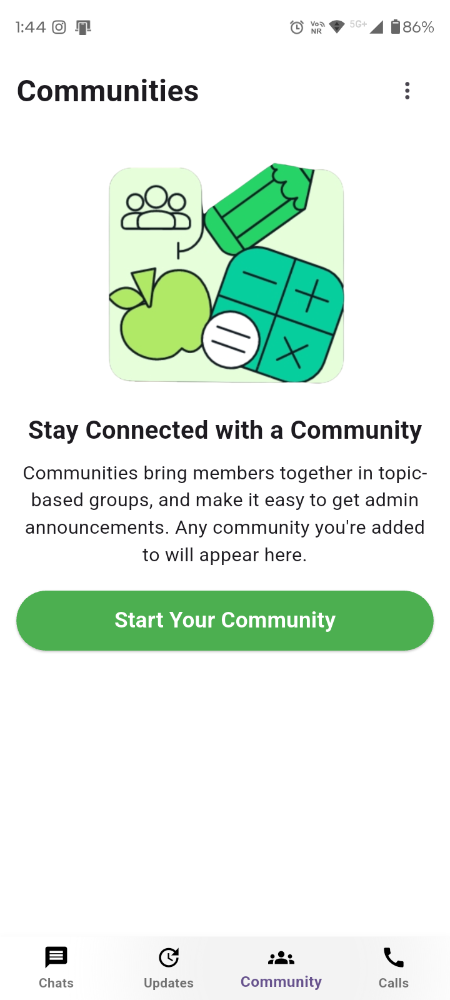

# 💬 WhatsApp Clone – Messaging App

**WhatsApp Clone** is a modern and user-friendly Flutter app that replicates the core features of WhatsApp. It features a clean interface for messaging, status updates, community management, and call history — all designed with a focus on seamless communication experience.

Built with **Flutter** and styled with **Google Fonts**, WhatsApp Clone delivers a smooth and intuitive messaging experience.

---

## 🧩 Features

### 💬 **Chats Screen**

* WhatsApp-style chat list interface
* Recent conversations with profile pictures
* Message status indicators:
  - Read (blue double check)
  - Delivered (grey double check)
  - Sent (single check)
  - No network (red timer icon)
* Timestamp display (time, "Yesterday", day names)
* Search functionality with Meta AI integration
* Quick action buttons:
  - QR code scanner
  - Camera access
  - More options menu
* Floating action buttons:
  - Meta AI assistant
  - New message composer

### 📱 **Updates Screen**

* Status updates section (similar to WhatsApp Stories)
* "Add status" option with 24-hour expiration notice
* Recent updates from contacts
* Status indicators with green borders
* Quick actions:
  - Edit status button
  - Camera button for creating new status

### 👥 **Communities Screen**

* Community management interface
* Welcome banner and description
* "Start Your Community" feature
* Topic-based group organization
* Admin announcements support

### 📞 **Calls Screen**

* Call history with detailed information
* Call type indicators:
  - Incoming calls (green arrow)
  - Outgoing calls (grey arrow)
  - Missed calls (red arrow)
* Video and voice call indicators
* Quick access actions:
  - Direct call
  - Schedule call
  - Keypad dialer
  - Favorite contacts
* Recent calls list with timestamps
* Floating action button for new calls

### 🎨 **Navigation**

* Bottom navigation bar with four main sections
* Smooth PageView integration for swiping between screens
* Material Design icons and styling
* Responsive layout for different screen sizes

---

## 🧠 Tech Stack

| Layer          | Tech Used                           |
|----------------|-------------------------------------|
| **Frontend**   | Flutter, Dart                      |
| **UI/UX**      | Material Design                     |
| **Typography** | Google Fonts (Roboto)               |
| **Platform**   | Android, iOS, Web, Windows, Linux, macOS |

---

## 📁 Folder Structure

```
whatsapp_clone/
├── lib/
│   ├── Pages/              # All app screens
│   │   ├── HomePage.dart         # Main navigation container
│   │   ├── ChatScreen.dart       # Chats list and messaging
│   │   ├── UpdatesScreen.dart    # Status updates
│   │   ├── CommunityScreen.dart  # Communities management
│   │   └── CallScreen.dart       # Call history
│   └── main.dart           # App entry point
├── assets/
│   ├── imageassets/        # Profile images, logos, and banners
│   │   ├── neil_verma.jpg
│   │   ├── Meta_AI_logo.png
│   │   └── communitiesBanner.png
│   └── Screenshots/        # App screenshots
│       ├── whatsappClone-s1.png
│       ├── whatsappClone-s2.png
│       ├── whatsappClone-s3.png
│       └── whatsappClone-s4.png
├── android/                # Android platform files
├── ios/                    # iOS platform files
├── web/                    # Web platform files
├── windows/               # Windows platform files
├── linux/                  # Linux platform files
├── macos/                  # macOS platform files
├── pubspec.yaml            # Dependencies
└── README.md               # This file
```

---

## 🧪 Setup Locally

1. **Clone the repository**

```bash
git clone https://github.com/yourusername/whatsapp_clone.git
cd whatsapp_clone
```

2. **Install Flutter dependencies**

```bash
flutter pub get
```

3. **Verify Flutter setup**

```bash
flutter doctor
```

4. **Run the Flutter app**

```bash
flutter run
```

For a specific device:

```bash
# List available devices
flutter devices

# Run on specific device
flutter run -d <device_id>
```

---

## 📱 Platform Support

WhatsApp Clone supports multiple platforms:

- ✅ **Android** - Fully supported
- ✅ **iOS** - Fully supported
- ✅ **Web** - Supported
- ✅ **Windows** - Supported
- ✅ **Linux** - Supported
- ✅ **macOS** - Supported

---

## 🎨 Design Features

* **Modern UI** - Clean and intuitive interface matching WhatsApp design
* **Responsive Design** - Adapts to different screen sizes
* **WhatsApp Color Scheme** - Green accent color (`#21C063`) for primary actions
* **Typography** - Roboto font family for consistent text styling
* **Image Assets** - Profile pictures and community banners
* **Smooth Navigation** - Bottom navigation bar with PageView integration
* **Status Indicators** - Visual feedback for message delivery and read status
* **Meta AI Integration** - AI assistant button for enhanced functionality

---

## 🚀 Getting Started

### Prerequisites

- Flutter SDK (3.9.2 or higher)
- Dart SDK
- Android Studio / VS Code with Flutter extensions
- Xcode (for iOS development on macOS)
- Git

### Installation Steps

1. Ensure Flutter is installed and configured
2. Clone this repository
3. Navigate to the project directory
4. Run `flutter pub get` to install dependencies
5. Connect a device or start an emulator
6. Run `flutter run` to launch the app

---

## 📸 Screenshots

<div align="center"> 
 
 
 
 
</div>

---

## 🔧 Development

### Project Structure

- **Pages**: All UI screens are located in `lib/Pages/`
- **Assets**: Images and resources in `assets/` directory
- **Main Entry**: `lib/main.dart` contains the app initialization

### Key Dependencies

- `google_fonts: ^6.3.2` - Custom typography (Roboto font)
- `cupertino_icons: ^1.0.8` - iOS-style icons

### Key Features Implementation

- **Bottom Navigation**: Implemented using `BottomNavigationBar` with `PageView` controller
- **Status Indicators**: Custom icon logic based on message delivery status
- **Call History**: Categorized by call type (incoming, outgoing, missed)
- **Community Banner**: Image asset integration for community feature

---

## 🤝 Contributing

Contributions are welcome! Please feel free to submit a Pull Request.

1. Fork the repository
2. Create your feature branch (`git checkout -b feature/AmazingFeature`)
3. Commit your changes (`git commit -m 'Add some AmazingFeature'`)
4. Push to the branch (`git push origin feature/AmazingFeature`)
5. Open a Pull Request

---

## 👨‍💻 Author

**Neil Verma**

---

## 🙏 Acknowledgments

- Flutter team for the amazing framework
- Google Fonts for typography
- WhatsApp for design inspiration
- All contributors and testers

---

**Made with ❤️ using Flutter**
